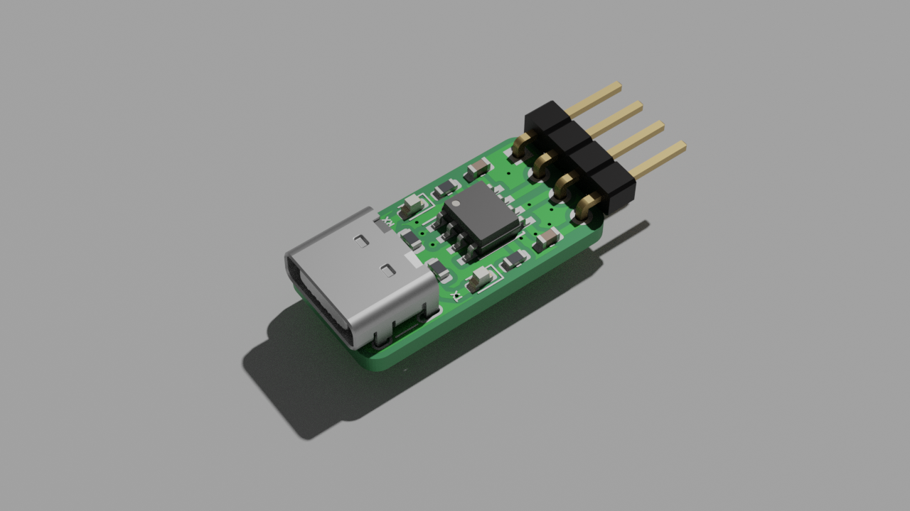

# USB-C UART Converter based on CH330

CH330 is crystal-less, <$0.35 USB UART converter in a SOIC-8 package. The CH330N
enumerates as CH340 or CH341 and its transfer speed goes up to ~2Mb/s.

Initially based on [Jan Henrik's prototype board][1]

## BOM

| Reference |  Value            |  Mfr. Part            |  Price                     |
| --------- | ----------------- | --------------------- | -------------------------- |
| U1        | CH330N            | CH330N                | US$ 0.5518                 |
| C2, C2    | 100n              | CC0603KRX7R9BB104     | US$ 0.175 for 50           |
| D1, D2    | LED               | 19-217/R6C-AL1M2VY/3T | US$ 0.282 for 20           |
| R1, R2    | 220               | 0603WAF2200T5E        | US$ 0.12 for 100           |
| R3, R4    | 5.1k              | 0603WAJ0512T5E        | US$ 0.12 for 100           |
| P1        | USB_C_Plug_USB2.0 | U262-161N-4BVC11      | US$ 0.32                   |
| J2        |                   |                       |                            |
| PCB       |                   |                       | US$ 20 for 5 with shipping |

[1]: https://github.com/Jan--Henrik/CH330_Hardware
